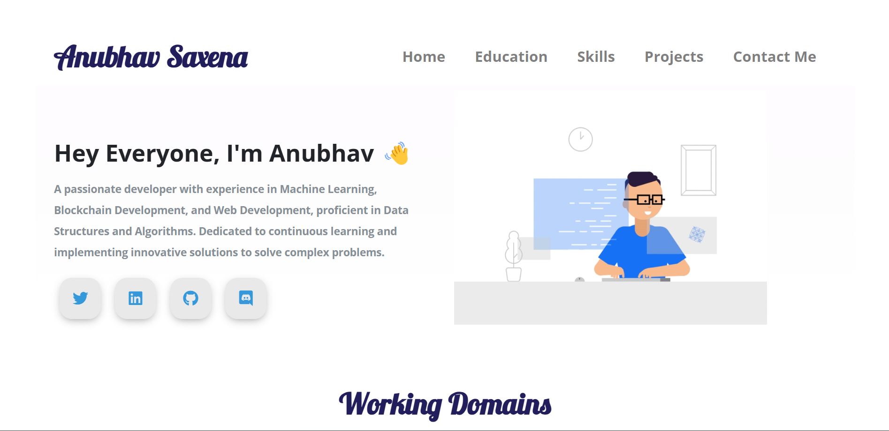
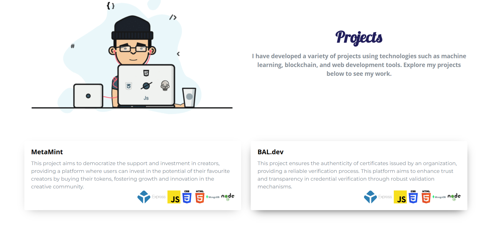
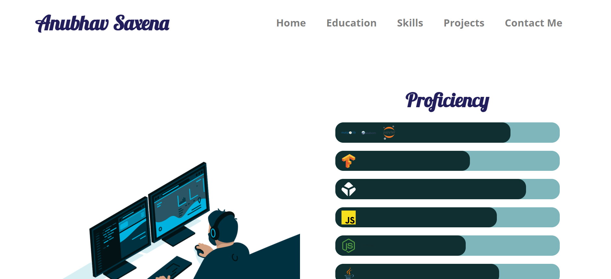

# 🚀 Portfolio Website

This repository contains all the code and files for my **Portfolio Website**. The website showcases my projects, skills, and experience, offering a glimpse into my journey as a **Blockchain & AI/ML Developer**.

## 📌 Features
- 🖥️ **Interactive UI** – A sleek, modern, and responsive design.
- ⚡ **Fast & Optimized** – Built with performance and SEO in mind.
- 🎨 **Customizable** – Easy to modify and extend with new features.
- 📱 **Mobile-Friendly** – Works seamlessly on all devices.

## 🛠️ Technologies Used
- **Frontend**: HTML, CSS, JavaScript
- **Backend**: Node.js, Express.js (if applicable)
- **Deployment**: GitHub Pages / Vercel / Netlify

## 📸 Preview

### 🌐 Homepage


### 🛠️ Projects Section


### 📞 Skills Section


## 📂 Installation & Setup
1. Clone the repository:
   ```sh
   git clone https://github.com/InflixOP/Portfolio-Website.git
